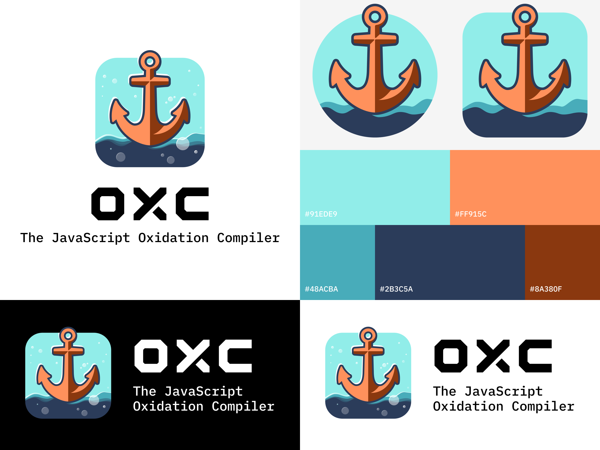

# Branding Assets for [oxc](https://github.com/oxc-project/oxc)

* Designed by [@tongtong-lu](https://github.com/tongtong-lu) and [@guan-wy](https://github.com/guan-wy)
* Font: https://fonts.google.com/specimen/IBM+Plex+Mono

## Icons

### SVG

  
  &nbsp;&nbsp;&nbsp;&nbsp;&nbsp;
  
  &nbsp;&nbsp;&nbsp;&nbsp;&nbsp;
  

### PNG

  
  &nbsp;&nbsp;&nbsp;&nbsp;&nbsp;
  

### ICO

  
  &nbsp;&nbsp;&nbsp;&nbsp;&nbsp;
  

## With bubbles

For larger displays and stickers.

### PNG

  
  &nbsp;&nbsp;&nbsp;&nbsp;&nbsp;
  

### SVG

  
  &nbsp;&nbsp;&nbsp;&nbsp;&nbsp;
  

## Banners

### Universal Background

  

### White and Dark Background

  
  &nbsp;&nbsp;&nbsp;&nbsp;&nbsp;
  

## Visuals

Colors: #91EDE9 #FF915C #48ACBA #2B3C5A #8A380F

## uwu

uwu images designed by [icarusgkx](https://x.com/icarusgkx)

  
  &nbsp;&nbsp;&nbsp;&nbsp;&nbsp;
  

